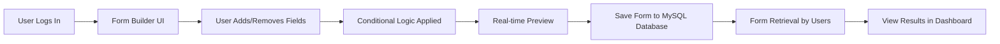

---

# 📝 **FormCraft – Dynamic Form Builder**

💡 *"Why spend hours coding a form when you can create it in seconds?"*

🚀 **FormCraft** is a next-generation **MERN-powered** application that transforms **a single prompt** into a **fully functional, customizable, and elegant form** — instantly.
Whether you’re a **developer** tired of repetitive boilerplate code or a **non-tech user** who just needs a beautiful form without touching code, FormCraft has you covered.

✨ Built with **Groq inference open-source models**, it understands your requirements in natural language and converts them into **polished, responsive forms** that:

* Adapt in **real-time** to user input and business logic.
* Maintain **UI consistency** across all use cases.
* Save **hours of manual coding** and debugging.

📌 **The Result:** More productivity, cleaner codebases, and a form-building experience so smooth, you’ll wonder how you ever worked without it.

---

## 🚀 **Features**  
- **Dynamic Form Creation** – Add, remove, and configure fields on the fly.  
- **Conditional Logic** – Show or hide fields based on user responses.  
- **Real-Time Preview** – See your form update instantly as you build.  
- **User Authentication** – Login and manage your created forms.  
- **Secure Data Storage** – Save forms and submissions in MySQL.  
- **Reusable & Flexible** – Adaptable for multiple use cases.  

---

## 🛠 **Tech Stack**  
| Frontend   | Backend   | Database | Others |
|------------|-----------|----------|--------|
| React.js   | Node.js   | MySQL    | Express.js, Redux Toolkit, GSAP |

---

## 🛠 **Workflow**  

---

## 🤝 **Contributing**
Contributions, issues, and feature requests are welcome!
Feel free to fork the repo and submit a pull request.

